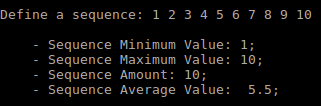

## Dojo Puzzle | Calculate Simple Statistics

A simple CMD application that allows you to calculate statistics. Add a sequence and let the software define some parameters, such as sequence minimum value, sequence maximum value, sequence average value, and sequence amount.
___

## Dependencies

- NodeJs - v12.16.1 or later
- TypeScript - v3.9.3 or later
___

## Getting Started

- Clone Project
- Install dependencies
- Start the project by running: `npm start`
- Server runs on your command line

## Application Example

## Rules Guide

